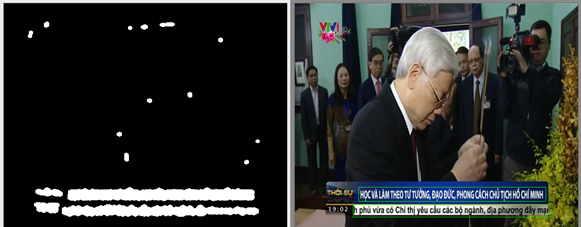
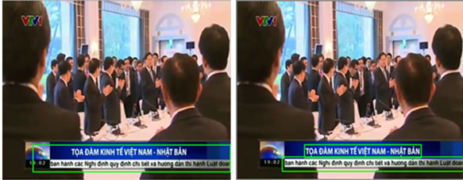

# text-region-extraction

Follow the description from [A New Morphology-based Method for Text Detection in Image and Video](https://research.ijcaonline.org/volume103/number13/pxc3899251.pdf) 

## 1. Method

6 steps described in **the paper (the algorithm 1)**:

+ Step 1: Generate the closing image and the opening image by two morphology transformation, dilate and erode 

+ Step 2: Getting absolute difference between them to increase the contrast between the possibly interesting regions and the rest of the image. 

+ Step 3:  Apply a low pass filter with a 5x5 mask to smooth out
noises and boundaries between text and background.

+ Step 4: Perform Otsu image binarization, using a threshold defined dynamically according to the background of the image.

+ Step 5: Applying a low pass filter to remove the noise, which threshold is introduced in step 4.

+ Step 6: Filter results by rates of rate of width and height of text region

**My adjustment (the algorithm 2)**:

+ Remove step 3 when text regions are clearly separated from background

+ Adjust step 5: using higher threshold = 2 * otsu

+ Adjust rate of filtering in step 6

After these steps, finding contours to obtain bounding boxs of text regions. 

These algorithms are implemented in:

https://github.com/anvy1102/text-region-extract/blob/master/MyLib/TextRegionExtract.cpp

## 2. Result

Visualizing the final step:

Results on VTV Broadcast videos. My adjustment (algorithm 2 on the right) has better result on VTV.

Results on HTV Broadcast videos. My adjustment (algorithm 2 on the right) has better result on HTV.

## Prequisites
+ C++
+ OpenCV 3. for C++
